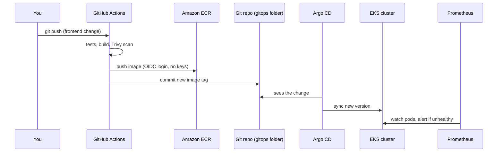
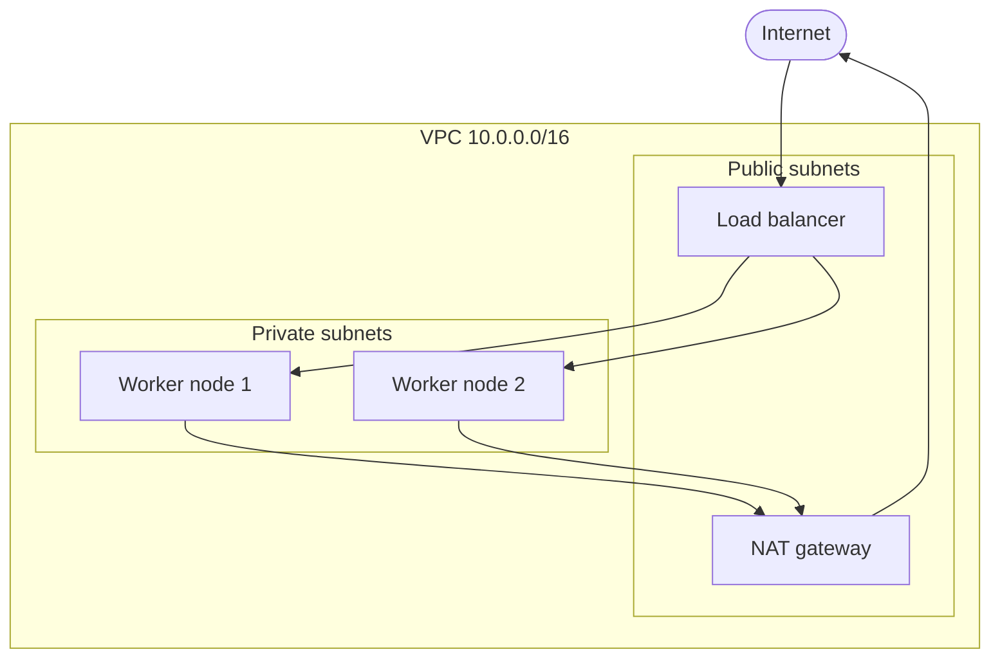

# Architecture notes

## What happens when I push

```mermaid
sequenceDiagram
    participant Dev as You
    participant GH as GitHub Actions
    participant ECR as Amazon ECR
    participant Git as Git repo (gitops folder)
    participant Argo as Argo CD
    participant K8s as EKS cluster
    participant Prom as Prometheus

    Dev->>GH: git push (frontend change)
    GH->>GH: tests, build, Trivy scan
    GH->>ECR: push image (OIDC login, no keys)
    GH->>Git: commit new image tag
    Argo->>Git: sees the change
    Argo->>K8s: sync new version
    Prom->>K8s: watch pods, alert if unhealthy
```

## Network layout

```mermaid
flowchart TB
    internet([Internet]) --> elb[Load balancer]
    subgraph vpc[VPC 10.0.0.0/16]
        subgraph pub[Public subnets]
            elb
            nat[NAT gateway]
        end
        subgraph priv[Private subnets]
            n1[Worker node 1]
            n2[Worker node 2]
        end
    end
    elb --> n1
    elb --> n2
    n1 --> nat
    n2 --> nat
    nat --> internet
```
